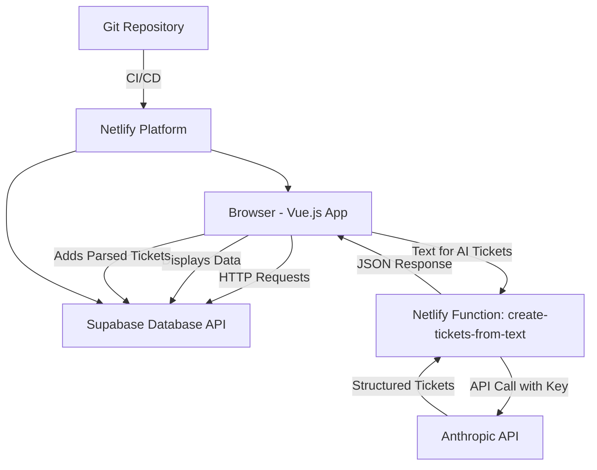
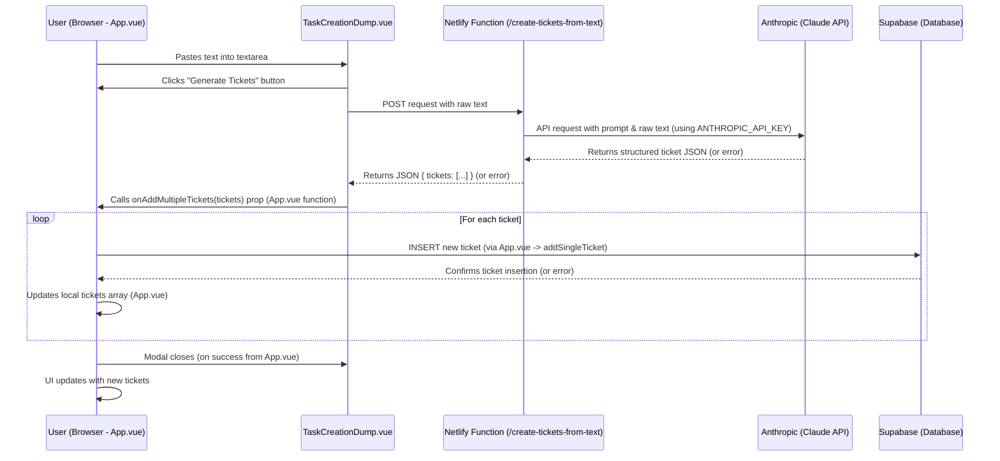

# Nick's Kanban Board

A dynamic, AI-powered Kanban board application for efficient task management, featuring remote data persistence with Supabase and AI-driven ticket creation using Anthropic (Claude).

## Features

- **Kanban Columns**: Customizable columns (e.g., Todo, In Progress, Done) for workflow visualization.
- **Drag & Drop**: Intuitive ticket movement between columns to update status.
- **Hierarchical Tickets**: Support for parent tasks and subtasks, maintaining clear project structures.
- **Category & Section Filtering**: Easily filter tickets to focus on specific areas.
- **AI-Powered Task Creation**: Paste unstructured text, and let an AI (Anthropic's Claude) generate structured tickets automatically.
- **Remote Data Persistence**: Ticket data is stored securely in a Supabase (PostgreSQL) database.
- **Responsive Design**: Adapts seamlessly to desktop, tablet, and mobile screens.
- **Real-time Potential**: Built on a foundation that can be extended for real-time updates (Supabase).

## Architecture Overview

This application employs a modern Jamstack architecture:

- **Frontend**: A Vue.js single-page application (SPA) built with Vite and styled with Tailwind CSS. It handles the user interface and all client-side interactions.
- **Backend (Serverless)**: Netlify Functions (Node.js) are used to securely interact with the Anthropic API for AI-driven ticket creation. This keeps the Anthropic API key off the client.
- **Database**: Supabase provides the PostgreSQL database for persistent storage of tickets, user authentication (optional extension), and real-time capabilities.
- **Deployment**: The frontend and serverless functions are deployed and hosted on Netlify.



## Tech Stack

- **Vue.js (v3)**: Core frontend framework for building the interactive UI.
- **Vite**: Next-generation frontend tooling for fast development and optimized builds.
- **Tailwind CSS**: Utility-first CSS framework for rapid UI development and responsive design.
- **Supabase**: Backend-as-a-Service (BaaS) providing:
    - PostgreSQL database for data storage.
    - Instant APIs for database interaction.
    - (Potential for Authentication, Realtime subscriptions).
- **Netlify**: Platform for:
    - Hosting the static Vue.js application.
    - Deploying and running serverless Node.js functions.
    - Continuous Integration and Deployment (CI/CD) from a Git repository.
- **Anthropic (Claude API)**: Used via a Netlify Function to parse unstructured text into structured ticket data.
- **Node.js**: Runtime for Netlify serverless functions.
- **JavaScript (ES6+)**: Primary programming language.

## Database Schema

The primary table in the Supabase PostgreSQL database is `tickets`:

```sql
CREATE TABLE public.tickets (
  id UUID PRIMARY KEY DEFAULT uuid_generate_v4(), -- Unique identifier for the ticket
  title TEXT NOT NULL,                            -- Concise title of the task
  description TEXT,                               -- Detailed description of the task
  status TEXT NOT NULL DEFAULT 'todo',            -- Current status (e.g., "todo", "inProgress", "done")
  category TEXT,                                  -- Task category (e.g., "Global Terminology", "Supply Partners")
  section TEXT,                                   -- Specific section within a category (e.g., "Main Table Screen", "Edit Drawer")
  is_subtask BOOLEAN DEFAULT FALSE,               -- True if this is a subtask
  parent_id UUID REFERENCES public.tickets(id) ON DELETE SET NULL, -- Foreign key to the parent ticket's ID
  created_at TIMESTAMPTZ DEFAULT now(),          -- Timestamp of when the ticket was created
  updated_at TIMESTAMPTZ DEFAULT now()           -- Timestamp of the last update
);

-- Trigger to automatically update updated_at on row modification
CREATE OR REPLACE FUNCTION public.handle_updated_at()
RETURNS TRIGGER AS $$
BEGIN
  NEW.updated_at = NOW();
  RETURN NEW;
END;
$$ LANGUAGE plpgsql;

CREATE TRIGGER on_ticket_update
  BEFORE UPDATE ON public.tickets
  FOR EACH ROW
  EXECUTE PROCEDURE public.handle_updated_at();

-- Row Level Security (RLS) should be enabled and configured for appropriate access control.
-- Example (adjust based on your auth strategy):
ALTER TABLE public.tickets ENABLE ROW LEVEL SECURITY;

CREATE POLICY "Public access for anon users" ON public.tickets
  FOR ALL USING (true) WITH CHECK (true);
-- For authenticated access, you would use policies like:
-- CREATE POLICY "Users can manage their own tickets" ON tickets
-- FOR ALL USING (auth.uid() = user_id) WITH CHECK (auth.uid() = user_id);
```

**Note on `id` and `parent_id`:** The UI internally uses `parentId` (camelCase) for consistency in JavaScript, while the database uses `parent_id` (snake_case). Transformations are handled in `App.vue`.

## Environment Variables

To run and deploy the application, the following environment variables are required:

1.  **For Local Development (create a `.env` file in the project root):**
    ```env
    # Supabase credentials (for client-side app)
    VITE_SUPABASE_URL=your_supabase_project_url
    VITE_SUPABASE_ANON_KEY=your_supabase_anon_public_key

    # Anthropic API Key (for local testing of Netlify functions via Netlify Dev CLI)
    ANTHROPIC_API_KEY=your_anthropic_api_key
    ```
    *   `VITE_` prefix is necessary for Vite to expose these variables to the client-side bundle.
    *   Add `.env` to your `.gitignore` file to prevent committing secrets.

2.  **For Netlify Deployment (set these in the Netlify UI: Site configuration > Environment variables):**
    *   `VITE_SUPABASE_URL`: Your Supabase project URL.
    *   `VITE_SUPABASE_ANON_KEY`: Your Supabase `anon` public key.
    *   `ANTHROPIC_API_KEY`: Your Anthropic API key (used by the serverless function, no `VITE_` prefix).

## Getting Started

1.  **Clone the Repository:**
    ```bash
    git clone <your-repository-url>
    cd <repository-name>
    ```

2.  **Install Dependencies:**
    ```bash
    npm install
    ```

3.  **Set Up Supabase:**
    *   Create a project on [Supabase](https://supabase.com).
    *   In the SQL Editor, run the schema script provided in the "Database Schema" section above to create the `tickets` table and related trigger.
    *   Configure Row Level Security (RLS) policies as needed for your access control strategy.

4.  **Set Up Anthropic:**
    *   Obtain an API key from [Anthropic](https://console.anthropic.com/).

5.  **Configure Environment Variables:**
    *   Create a `.env` file in the project root (as described above) with your Supabase and Anthropic credentials.

6.  **Run Development Server:**
    *   To run the Vue app and Netlify functions locally (recommended):
        ```bash
        netlify dev
        ```
    *   Alternatively, to run only the Vue app (AI feature will not work without Netlify Dev or deployment):
        ```bash
        npm run dev
        ```
    *   Open your browser to the displayed URL (typically `http://localhost:8888` for `netlify dev` or `http://localhost:5173` for `npm run dev`).

7.  **Seed Initial Data (Optional but Recommended):**
    *   The project includes a script to seed initial data from `src/utils/ticketParser.js` into your Supabase database.
    *   Ensure your `.env` file is configured correctly.
    *   Run the seed script:
        ```bash
        node scripts/seedSupabase.js
        ```

## Building for Production

```bash
npm run build
```
This command will generate a `dist/` directory with the optimized static assets for your Vue application and prepare serverless functions from `netlify/functions`.

## Deployment to Netlify

1.  **Push to Git:** Ensure your project is a Git repository and changes are pushed (e.g., to GitHub, GitLab, Bitbucket).
2.  **Connect to Netlify:**
    *   Log in to [Netlify](https://www.netlify.com).
    *   Click "Add new site" -> "Import an existing project".
    *   Connect to your Git provider and select your repository.
3.  **Configure Build Settings:**
    *   **Branch to deploy:** `main` (or your primary branch).
    *   **Build command:** `npm run build`
    *   **Publish directory:** `dist`
    *   **Functions directory:** `netlify/functions` (Netlify might auto-detect this if you have a `netlify.toml` file).
4.  **Add Environment Variables:** In your site's settings on Netlify (Site configuration > Environment variables), add:
    *   `VITE_SUPABASE_URL`
    *   `VITE_SUPABASE_ANON_KEY`
    *   `ANTHROPIC_API_KEY`
5.  **Deploy:** Netlify will automatically build and deploy your site upon pushes to the configured branch.

## AI Task Creation Feature

The "AI Task Creation Dump" feature allows users to paste unstructured text (e.g., meeting notes, a paragraph of requirements). This text is sent to a Netlify serverless function, which then queries the Anthropic (Claude) API. A carefully crafted prompt guides the AI to parse the text and return a structured JSON array of potential tickets. These tickets are then added to the Kanban board and persisted in Supabase.

**Data Flow Diagram:**



- **Prompt Engineering**: The quality of AI-generated tickets heavily depends on the prompt sent to Anthropic. The current prompt is located in `netlify/functions/create-tickets-from-text.js` and can be refined for better accuracy and handling of complex scenarios like subtask relationships.

## Extensibility (Previously from original README)

The application is designed to be easily extensible:
- Additional columns can be added by modifying the board's configuration.
- New ticket properties can be included by extending the ticket data model in `App.vue`, the Supabase schema, and the Anthropic parsing prompt.
- The filtering system can be expanded to include more criteria.

---
*This README provides a comprehensive overview. For specific component interactions or advanced configurations, please refer to the source code.* 